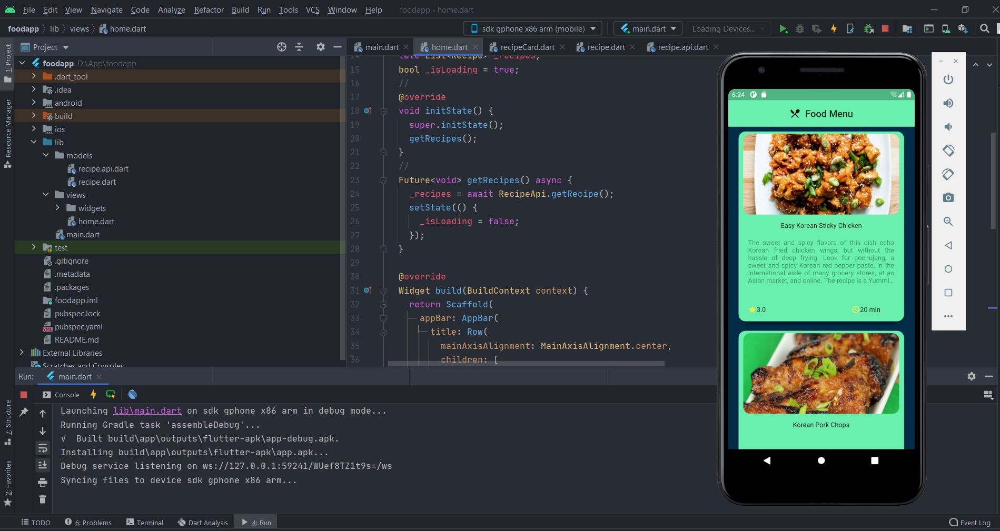
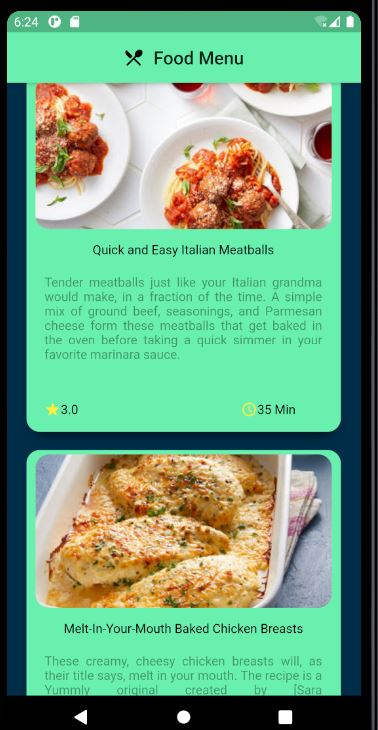

# Food Menu Mobile Application

App Developed Using Flutter SDK and Android Studio.

# INFO
Mobile Application design by using RapidAPI, Flutter SDK and Android Studio in Dart Language. Yummly is the api used in this mobile application.  
Simple UI design and Support in IOS and Android systems.

Color codes :
- #FF69F0AE
- #FF2196F3
- #FF4CAF50

# IMAGES

# LICENSE
MIT License: 
- Feel free to use the code as you please
